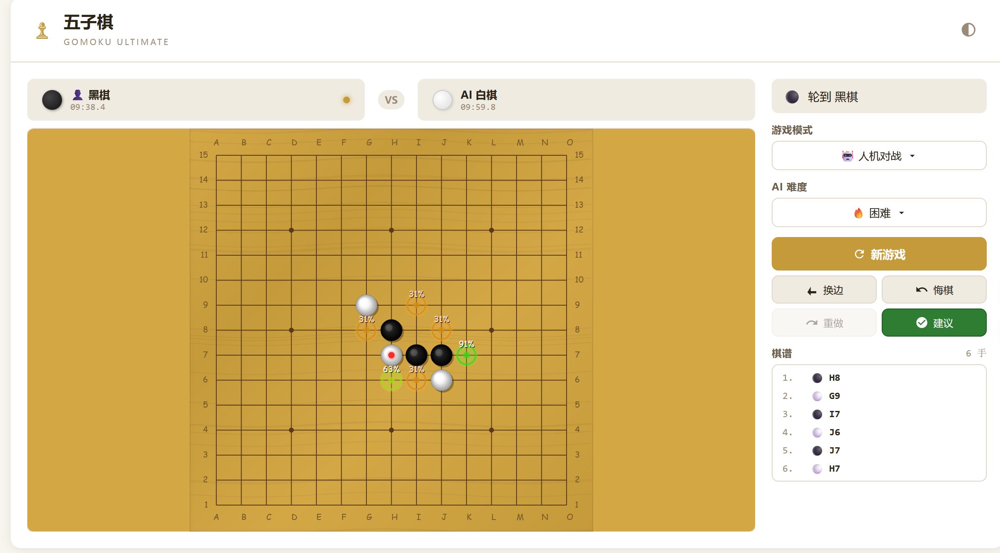

# ♟ 五子棋 Ultimate — Gomoku Ultimate

> **终极五子棋游戏** · 最强浏览器端 AI · 精美视觉 · 多模式对战

[](https://github.com/yourname/gomoku-ultimate)
[](https://www.typescriptlang.org/)
[](https://vitejs.dev/)
[](LICENSE)

---

## ✨ 功能特性

### 🎮 三种游戏模式
| 模式 | 说明 |
|------|------|
| **🤖 人机对战** | 与 AI 一决高下，4 级难度可选 |
| **👤 双人对战** | 两人轮流在同一设备上对战 |
| **🧠 AI 自对弈** | 观看 AI 自我博弈，学习棋路 |

### 🤖 AI 引擎
- **TSS (Threat Space Search)** — 威胁空间搜索，通过检测"威胁-代价"进行强制赢棋搜索
  - 识别五连、活四、冲四、活三等威胁棋型
  - 防御方必须同时填满所有"代价格"才能化解威胁
  - 深度 2 已超越传统 αβ 深度 8 的棋力
- **αβ 搜索 (Minimax + Alpha-Beta 剪枝)** — 备选搜索引擎
- **启发式评估函数** — 识别活四、冲四、活三、眠三、活二等棋型
- **智能走法排序** — 最佳优先搜索，提升剪枝效率
- **快速候选点生成** — 仅搜索棋子附近的关键位置

### 🎨 视觉设计
- **木质纹理棋盘** — 细腻的渐变渲染
- **3D 立体棋子** — 径向渐变 + 高光反射 + 投影
- **最后落子标记** — 红色高亮圆点
- **获胜连线动画** — 脉冲呼吸光效
- **深色主题 / 浅色主题** 一键切换
- **坐标标注** — 字母 + 数字，复盘更方便

### ⚙️ 其他功能
- **悔棋 / 重做** — 随时回退或前进
- **交换黑白** — 一键切换先后手
- **计时器** — 双方各自计时（10 分钟）
- **实时棋谱** — 记录每一步，支持滚动查看
- **响应式布局** — 桌面 / 平板 / 手机均适配

---

## 🚀 快速开始

### 在线试玩
👉 [https://yourname.github.io/gomoku-ultimate](https://yourname.github.io/gomoku-ultimate)

### 本地运行

```bash
# 克隆
git clone https://github.com/yourname/gomoku-ultimate.git
cd gomoku-ultimate

# 安装依赖
npm install

# 启动开发服务器
npm run dev

# 构建生产版本
npm run build
```

构建后的文件位于 `dist/` 目录，可直接部署到任何静态服务器。

---

## 🏗️ 项目架构

```
gomoku-ultimate/
├── index.html              # 入口 HTML
├── package.json            # 依赖配置
├── tsconfig.json           # TypeScript 配置
├── vite.config.ts          # Vite 构建配置
├── src/
│   ├── main.ts             # 应用入口
│   ├── style.css           # 全局样式 + 主题变量
│   ├── core/               # 核心游戏引擎
│   │   ├── types.ts        # 类型定义 + 常量
│   │   ├── Board.ts        # 棋盘状态管理 (15×15)
│   │   └── Game.ts         # 游戏控制器 (规则/计时/悔棋)
│   ├── ai/                 # AI 引擎
│   │   ├── AI.ts           # AI 入口 + 异步调用
│   │   ├── tss.ts          # TSS 威胁空间搜索 (主力引擎)
│   │   ├── evaluate.ts     # 评估函数 (棋型识别 + 位置权重)
│   │   ├── search.ts       # Minimax + Alpha-Beta 搜索 (备选)
│   │   ├── transposition.ts# 置换表 (Zobrist 哈希)
│   │   └── battle.ts       # αβ vs TSS 对弈测试
│   └── ui/                 # 用户界面
│       ├── BoardRenderer.ts # Canvas 渲染 (木纹/棋子/动画)
│       └── UIManager.ts    # UI 管理 (模式/难度/控制)
└── README.md
```

---

## 🧠 AI 技术细节

### 主要引擎 — TSS (Threat Space Search)

威胁空间搜索通过识别"威胁-代价"关系进行强制赢棋搜索。

```
TSS 威胁空间搜索
├── 威胁检测 (findThreats)
│   ├── FIVE (五连)      — 直接获胜
│   ├── STRAIGHT_FOUR (活四) — 防御需填两格
│   ├── FOUR (冲四)       — 防御需填一格
│   └── THREE (活三)      — 防御需填两格
├── 强制搜索 (tssSearch)
│   ├── 攻击方下"得益点" (gain square)
│   ├── 防御方填所有"代价格" (cost squares)
│   ├── 递归检测是否仍有威胁
│   └── 深度 3, 每节点最多 5 分支
└── 回退策略
    └── getOrderedMoves — 启发式评分选最佳走法
```

### 备选引擎 — αβ 搜索

```
Minimax + Alpha-Beta 剪枝
├── 迭代加深 (Iterative Deepening)
│   ├── Easy:   深度 2
│   ├── Medium: 深度 4
│   ├── Hard:   深度 6
│   └── Expert: 深度 8+
├── 走法排序 (Move Ordering)
│   ├── 进攻评分: 当前方棋型
│   ├── 防守评分: 对方棋型
│   └── 位置权重: 越靠近中心越高
└── 智能剪枝
    ├── 立即获胜检测
    ├── 立即防守检测
    └── 超时保护 (长时搜索自动中断)
```

### 性能对比 (TSS d2 vs αβ 各难度, 30 局)

| αβ 难度 | αβ 胜 | TSS 胜 | 结论 |
|---------|-------|--------|------|
| Medium (d4) | 3 | 17 | TSS 碾压 |
| Hard (d6)   | 0 | 6  | TSS 全胜 |
| Expert (d8) | 2 | 2  | TSS 平手 |
| **汇总**    | **5** | **25** | **TSS 胜率 83%** |

### 评估函数

评估函数识别以下棋型并赋予不同权重：

| 棋型 | 分值 | 说明 |
|------|------|------|
| 🔴 **连五 (Five)** | 10,000,000 | 直接获胜 |
| 🟠 **活四 (Live Four)** | 500,000 | 两端开放的四子，几乎必胜 |
| 🟡 **冲四 (Rush Four)** | 50,000 | 一端开放的四子 |
| 🟢 **活三 (Live Three)** | 15,000 | 两端开放的三子 |
| 🔵 **眠三 (Sleep Three)** | 2,000 | 一端开放的三子 |
| 🟣 **活二 (Live Two)** | 500 | 两端开放的二子 |
| ⚪ **眠二 (Sleep Two)** | 100 | 一端开放的二子 |

---

## 📸 截图



---

## 🛠️ 技术栈

- **语言**: TypeScript 5.6
- **构建**: Vite 6
- **渲染**: HTML5 Canvas 2D
- **AI**: TSS 威胁空间搜索 + αβ 剪枝 + 启发式评估
- **样式**: CSS Variables (主题系统)

## 📄 许可证

MIT License © 2026

---

**⭐ 如果喜欢这个项目，欢迎 Star！**
