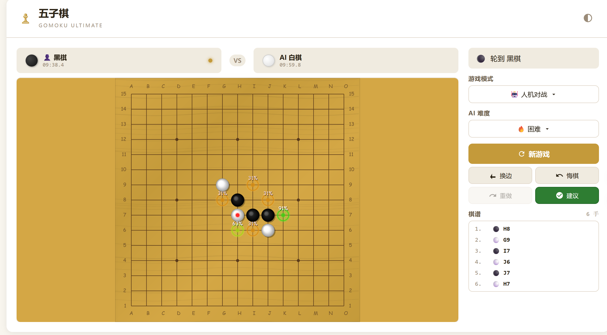

# 五子棋 Ultimate

一个本地运行的浏览器五子棋。棋盘、AI 和棋谱都在浏览器中完成，没有账户或服务端。



## 刚刚好的功能

| 能力 | 实际行为 |
| --- | --- |
| 对局方式 | 人机、双人同机、AI 自对弈三种模式 |
| AI 难度 | 简单、中等、困难、专家四档；以 TSS 为主并由启发式排序兜底 |
| 对局控制 | 独立 10 分钟计时、悔棋、重做、换边和实时棋谱 |
| 棋盘反馈 | 最后落子标记、胜局连线、候选建议、浅色与深色主题 |
| 适配 | Canvas 棋盘随容器尺寸调整，支持触摸落子 |

AI 的候选点只在已有棋子附近生成；存在强制取胜威胁时使用 Threat Space Search，否则使用局面评估排序。计算结果只会提交到发起计算的棋局，重开或换边不会被旧结果干扰。

## 本地运行

需要 Node.js 20+ 与 npm：

```bash
git clone https://github.com/hkm-a/gomoku-ultimate.git
cd gomoku-ultimate
npm ci
npm run dev
```

执行规则测试与生产构建：

```bash
npm test
npm run build
```

构建产物位于 `dist/`，可部署至任意静态文件服务器。

## 结构

```text
src/
├── core/  # 棋盘、规则、计时与棋谱
├── ai/    # TSS、候选点评估与搜索辅助
└── ui/    # Canvas 渲染与交互控制
tests/     # 对局规则与异步行为回归测试
```

## 边界

项目专注于单设备对局，不包含账户、联机匹配、云端棋谱或服务端对战。这些能力需要独立的同步与反作弊设计，不应作为本地棋局的隐性依赖。

## 许可证

本项目使用 [MIT 许可证](LICENSE)。
